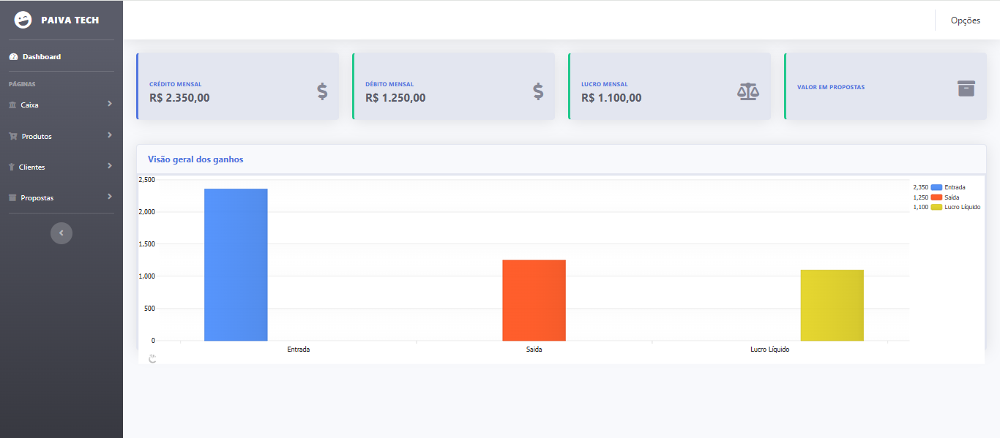
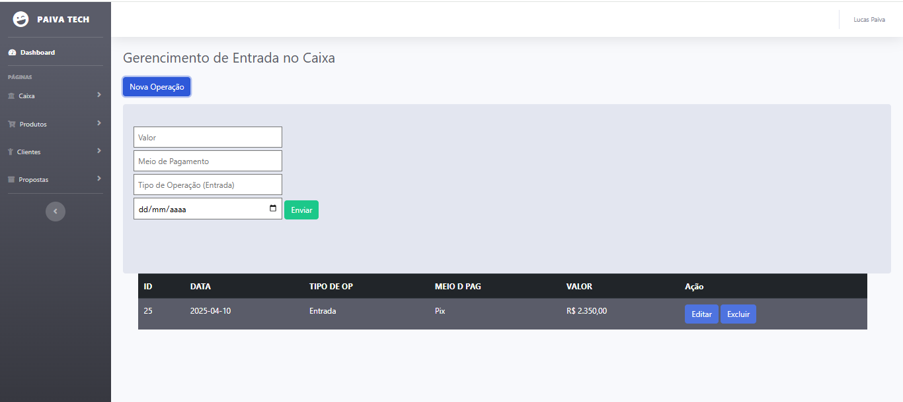
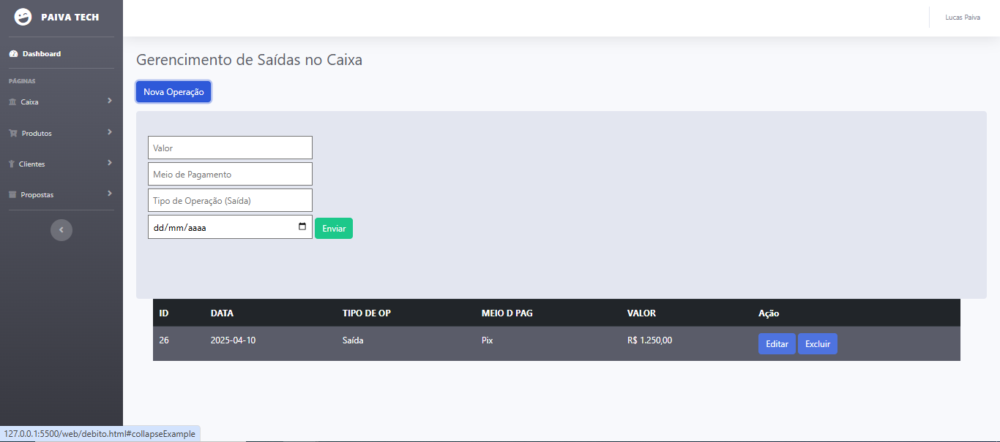
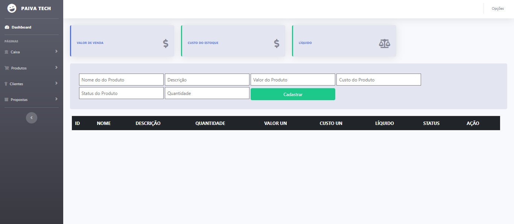
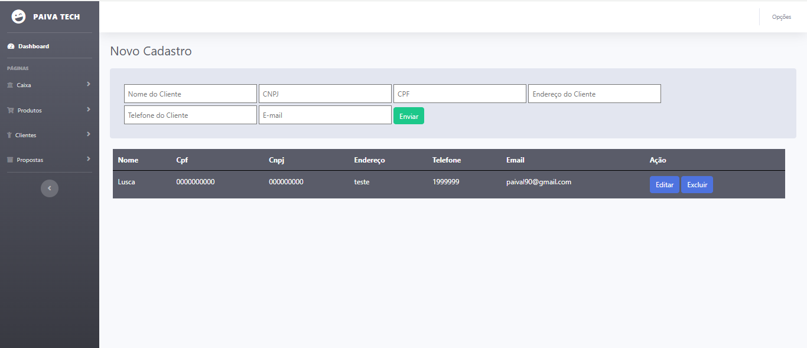
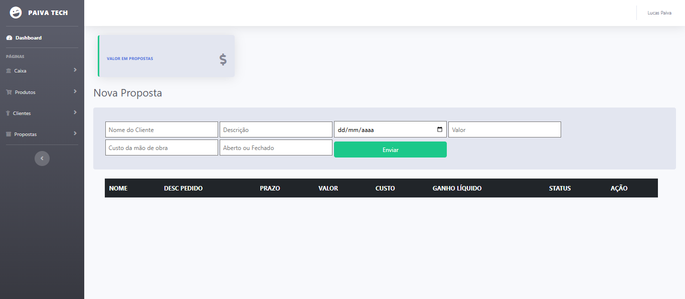

# Aula 06

- Utilize os seus conhecimentos para desenvolver um dashboard exatamente igual a esse da imagem abaixo.
- A pasta "api" que esta nesse repositório contém com o back-end ja funcional de 2/4 do projeto, onde está funcionando o cadastro de entrada e saída de dinheiro e o cadastro dos clientes.

- Como desafio, após finalizar a criação das páginas, agregue as funcionalidades de, cadastro e amostra dos produtos e cadastro e amostra das propostas.

Segue abaixo os wireframes restantes:

- .Env
DATABASE_URL="mysql://root@localhost:3306/fluxocaixa?schema=public&timezone=UTC"
